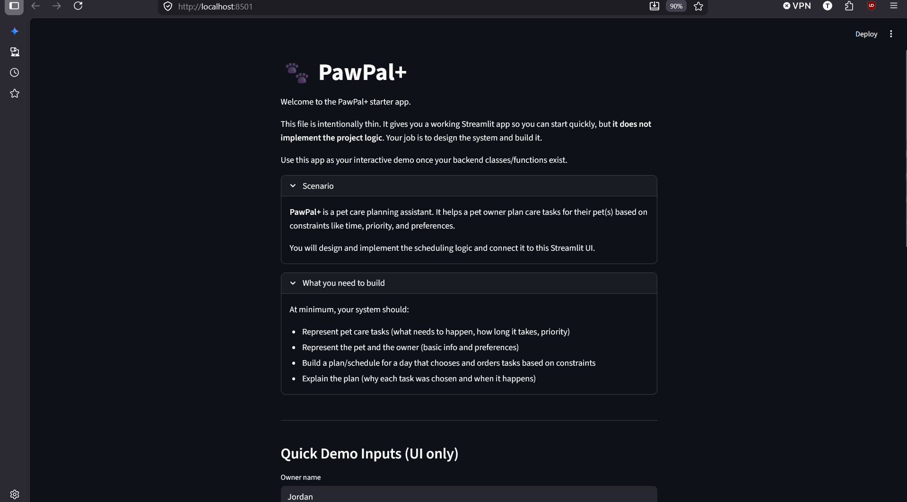

# PawPal+ Project Reflection

## 1. System Design

**a. Initial design**

- Briefly describe your initial UML design.
Ans: "Owner" has the attributes Pet and list of Task. Scheduler use the information of Owner to create a plan 
- What classes did you include, and what responsibilities did you assign to each?
Ans: I included
+ Pet: store pet's information 
+ Task: blueprint for care activities
+ Owner: hold user constraints, preferences, pet, and list of tasks need to do
+ ScheduledTask: an extension of Task that has start and end time 
+ Plan: a container of multiples ScheduledTask objects
+ Scheduler: the engine of application, used to generate Plan
**b. Design changes**

- Did your design change during implementation?
yes 
- If yes, describe at least one change and why you made it.
 I originally had `Scheduler.generate_plan()` use the owner's `available_hours_per_day` and schedule everything starting at 08:00 by default, which was too rigid. I updated the design and implementation to accept a configurable `start_time` and optional `available_hours` parameter, so the schedule can begin at any user-preference time and handle variable slots, while keeping backward compatibility with the default behavior.
---

## 2. Scheduling Logic and Tradeoffs

**a. Constraints and priorities**

- What constraints does your scheduler consider (for example: time, priority, preferences)?
- How did you decide which constraints mattered most?

**b. Tradeoffs**

- Describe one tradeoff your scheduler makes.
Ans: the scheduler performs a simple overlap check and returns human-readable warnings rather than automatically rescheduling or blocking tasks. This keeps the implementation small and predictable and avoids making assumptions about which task should be moved or dropped. The tradeoff is that overlapping tasks may still remain in the plan and require manual user action
- Why is that tradeoff reasonable for this scenario?
Ans: because the app is only used for small personal schedulling, not for production-grade planning

---

## 3. AI Collaboration

**a. How you used AI**

- How did you use AI tools during this project (for example: design brainstorming, debugging, refactoring)?
- What kinds of prompts or questions were most helpful?

**b. Judgment and verification**

- Describe one moment where you did not accept an AI suggestion as-is.
- How did you evaluate or verify what the AI suggested?

---

## 4. Testing and Verification

**a. What you tested**

- **Sorting Correctness:** Verified `Scheduler.sort_by_time` returns tasks in chronological order (HH:MM).
- **Recurrence Logic:** Confirmed that marking a `daily` task complete via `Pet.mark_task_complete` appends a new task with `due_date` advanced by one day and `completed=False`.
- **Conflict Detection:** Checked `Scheduler.detect_conflicts` flags overlapping scheduled tasks and returns readable warnings.

These tests focus on the core scheduling behaviors that determine whether the app produces a usable, predictable plan for a pet owner. Sorting ensures the UI and plan are chronologically sensible; recurrence keeps daily care continuous; conflict detection surfaces issues owners must resolve.

**b. Confidence**

- How confident are you that your scheduler works correctly?
- What edge cases would you test next if you had more time?

---

## 5. Reflection

**a. What went well**

- What part of this project are you most satisfied with?

**b. What you would improve**

- If you had another iteration, what would you improve or redesign?

**c. Key takeaway**

- What is one important thing you learned about designing systems or working with AI on this project?

## 6. Demo

Click the image to open the full-resolution demo in a new tab.

